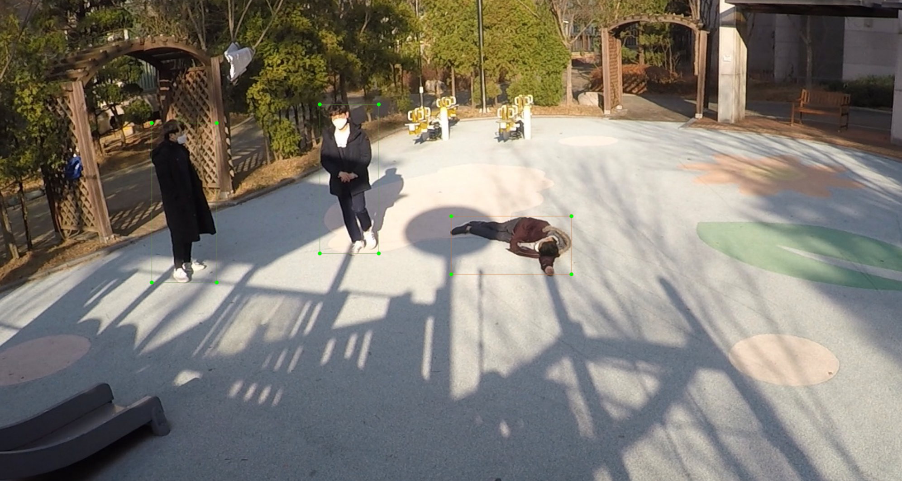

# Swoon Detector
---
 This repository is conducted by Lee et al. as a final result of the AI Grand Challenge([Homepage](https://ai-challenge.kr)).
 Our task is to detect a fallen person who needed help. We got 3rd place in this challenge. We created this repository to share our results.

#### install requirements.txt
`pip install -r requirements.txt`

#### execute predict.py
 you can test our model by executing `python predict.py <your dataset path>`.

 [input] \
 `<your dataset path>` must follow that below file directory structure

 ~~~
/your dataset path
  /video_1
    /video_1_001.jpg
    /video_2_002.jpg
    /...
  /video_2
    /video_2_001.jpg
    /video_2_002.jpg
    /...

 ~~~
you don't have to follow file name but, maintain file structure

[output]
After inference, you can get a json file.
The structure of the json file is as follows.

~~~
{
  'annotations':[
    {
      'file_name': 'video_1_001.jpg', # if two or more swoon people exist in frame
      'box':[{
        'position':[150, 150, 300, 300],   # xyxy
        'confidence_score': '0.9987'
        },
        {
        'position':[560, 560, 900, 900],
        'confidence_score': '0.98'
          }]
    },
    {
      'file_name': 'video_1_002.jpg', # if no swoon person in frame
      'box': []
    },
    {
      'file_name': 'video_1_003.jpg', # if just one swoon person in frame
      'box':[{
        'position': [200, 200, 400, 400] # xyxy
        'confidence_score': '0.899'
        }]
    }
  ]
}
~~~

you can make video using generated json file (Script will be uploaded soon..)\
example\

### TODO
- trainable code
- some useful scripts
